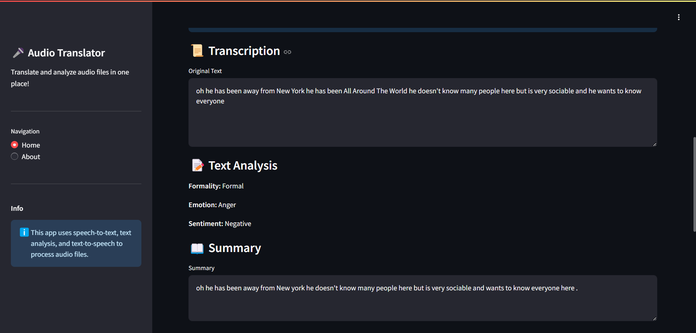

# Language Translator

## Table of Contents
- [Overview](#overview)
- [Features](#features)
- [Technologies Used](#technologies-used)
- [Installation](#installation)
- [Usage](#usage)
- [Screenshots](#screenshots)
- [Contributing](#contributing)
- [License](#license)
- [Contact](#contact)

## Overview
The **Language Translator** project is a tool designed to translate text between multiple languages with ease. It leverages advanced machine learning models and APIs to provide fast, reliable, and accurate translations. This application is ideal for multilingual communication, content localization, or learning new languages.

## Features
- Supports translation for hindi more coming soon.
- User-friendly interface for text input and output.
- Ability to translate large text files.

## Technologies Used
- **Programming Language**: Python
- **Libraries and Frameworks**:
  - Sklearn (for classication model training)
  - TensorFlow/Keras (for model training)
  - NLTK (for text preprocessing)
  - StreamLit (For Interface)
- **Other Tools**: Jupyter Notebook, NumPy, Pandas

## Installation

Follow these steps to set up the project on your local machine:

1. **Clone the Repository**:
   ```bash
   git clone https://github.com/Psyduck21/LanguageTranslator.git
   cd LanguageTranslator
   ```

2. **Set Up a Virtual Environment (Optional but Recommended)**:
   ```bash
   python -m venv venv
   source venv/bin/activate  # On Windows: venv\Scripts\activate
   ```

3. **Install Dependencies**:
   ```bash
   pip install -r requirements.txt
   ```

4. **Download Pre-trained Models** (if applicable):
   - It will automatically download models in `pre-models/` directory.
   - Dowload glove.6B.100d.txt from [GloVe on Stanford NLP](https://nlp.stanford.edu/projects/glove/) Place the file in `Models/Emotion Classifier/`

5. **Run the Application**:
   ```
   run the file LanguageTranslator.bat
   ```

## Usage
1. Open the application by running `LanguageTransaltor.bat` file.
2. Drag and drop the input.mp3 file in `input/` dir.
3. Click "process" to see the output.
4. For file translations, upload the file and download the translated version.

## Screenshots
*Add screenshots of the interface or example outputs here.*
StreamLit Interface ScreenShots

### Home Page


### Upload Section


### Transcription And Tone Analysis


### Translation Section


### About Section


## License
This project is licensed under the MIT License - see the [LICENSE](LICENSE) file for details.

## Contact
For any questions or suggestions, feel free to reach out:
- **GitHub**: [Psyduck21](https://github.com/Psyduck21)
- **Email**: [akshat.prj@google.com](mailto:akshat,prjl@google.com)

---

Thank you for checking out the Language Translator project! 😊
